<div align="center">


# Katstruction.

### Platform Pelaporan Infrastruktur Berbasis AI untuk Kolaborasi Warga dan Pemerintah

[](https://[URL_DEMO])
[](https://[URL_REPO])
[](LICENSE)

**Submission for ITECHNO CUP 2026 - Web Development**

**By WNI Suka Bobo**

</div>

---

## Daftar Isi

- [Tentang Proyek](#tentang-proyek)
- [Fitur Unggulan](#fitur-unggulan)
- [Demo dan Screenshot](#demo-dan-screenshot)
- [Teknologi](#teknologi)
- [Arsitektur Sistem](#arsitektur-sistem)
- [Instalasi dan Setup](#instalasi-dan-setup)
- [Penggunaan](#penggunaan)
- [API Documentation](#api-documentation)
- [Testing](#testing)
- [Tim Developer](#tim-developer)
- [Lisensi](#lisensi)

---

## Tim Developer

Lengkapi data berikut sesuai anggota tim proyek.

| Nama | Peran | GitHub |
|------|-------|--------|
| **Muhana Fawwas Sausan** | Project Lead dan Full Stack Developer | [GitHub](https://github.com/hnfws) |
| **Kevin Chandra Syahrial** | Full Stack Developer & UI/UX Designer | [GitHub](https://github.com/04keishi) |

---

## Tentang Proyek

### Latar Belakang

### Latar Belakang

Kerusakan jalan seperti lubang, retakan, dan kerusakan permukaan dapat mengganggu mobilitas masyarakat serta meningkatkan risiko kecelakaan. Namun, proses pelaporan dan penanganan kerusakan jalan masih menghadapi tantangan, terutama dalam mengumpulkan laporan masyarakat, memverifikasi kondisi kerusakan, serta menentukan laporan yang perlu ditangani terlebih dahulu.

Banyaknya laporan dari masyarakat juga dapat menyebabkan pengelola kesulitan menentukan prioritas perbaikan apabila setiap laporan hanya dipandang sebagai pengaduan secara terpisah. Padahal, tingkat keparahan kerusakan, urgensi, lokasi, kondisi lingkungan, serta jumlah masyarakat yang terdampak dapat menjadi pertimbangan dalam menentukan prioritas penanganan.

Oleh karena itu, dibutuhkan sebuah sistem yang tidak hanya menjadi media pelaporan kerusakan jalan, tetapi juga mampu mengolah laporan masyarakat menjadi informasi yang membantu pengelola menentukan prioritas perbaikan secara lebih terstruktur.

### Solusi yang Ditawarkan

**Katstruction** merupakan platform pelaporan dan pemantauan kerusakan jalan berbasis Artificial Intelligence (AI) yang menghubungkan masyarakat dengan pengelola infrastruktur jalan.

Masyarakat dapat melaporkan kerusakan jalan dengan mengunggah foto, memberikan deskripsi, serta menentukan lokasi kerusakan. Data tersebut kemudian dianalisis oleh AI untuk membantu mengidentifikasi kondisi kerusakan dan menentukan tingkat **severity**, **urgency**, serta **priority score** pada setiap laporan.

Katstruction juga menyediakan fitur **vote** yang memungkinkan masyarakat lain memberikan dukungan terhadap laporan yang mereka anggap penting. Jumlah dukungan tersebut dapat menjadi salah satu faktor tambahan dalam menentukan prioritas penanganan.

Selain itu, informasi koordinat lokasi laporan dapat digunakan untuk menampilkan persebaran kerusakan jalan pada peta serta mengambil informasi kondisi cuaca di sekitar lokasi. Kondisi tersebut dapat digunakan sebagai konteks tambahan dalam menilai risiko, misalnya ketika kerusakan jalan berada di wilayah yang sedang mengalami hujan.

Dengan demikian, Katstruction tidak hanya berfungsi sebagai platform pengaduan kerusakan jalan, tetapi sebagai **sistem pendukung pengambilan keputusan** yang memanfaatkan AI, data lokasi, dan partisipasi masyarakat untuk membantu pengelola menentukan kerusakan jalan yang perlu diprioritaskan terlebih dahulu.

### Tujuan Proyek

**Tujuan Utama**: Memudahkan masyarakat melaporkan kerusakan jalan serta membantu pengelola menentukan prioritas penanganan berdasarkan tingkat keparahan, urgensi, risiko, dan dukungan masyarakat.
**Target Pengguna**: Masyarakat sebagai pelapor dan pengelola/instansi yang bertanggung jawab terhadap infrastruktur jalan.
**Value Proposition**: Pelaporan kerusakan jalan yang terstruktur, analisis berbasis AI, pemetaan lokasi, dukungan masyarakat, dan pemantauan status penanganan dalam satu platform.

---

## Fitur Unggulan

### Fitur Utama


## Fitur Unggulan

### Fitur Utama

| Fitur | Deskripsi | Keunggulan |
|----------|--------------|---------------|
| **Pelaporan Kerusakan Jalan** | Masyarakat mengirimkan deskripsi, foto, lokasi, dan koordinat kerusakan jalan tanpa perlu login. | Data kerusakan lebih lengkap dan mudah dianalisis serta ditindaklanjuti. |
| **Analisis AI** | AI menganalisis foto dan deskripsi untuk menghasilkan tingkat keparahan (*severity*), urgensi (*urgency*), potensi risiko (*potential risk*), dan ringkasan laporan. | Membantu pengelola memahami kondisi kerusakan secara cepat dan terstruktur. |
| **Skor Prioritas** | Sistem menghitung *priority score* berdasarkan tingkat keparahan, urgensi, risiko, dan dukungan masyarakat. | Membantu pengelola menentukan laporan yang membutuhkan penanganan lebih dahulu. |
| **Dukungan Masyarakat** | Masyarakat dapat melakukan *upvote* dan *unvote* pada laporan tanpa login menggunakan identitas anonim berbasis browser. | Menunjukkan tingkat perhatian masyarakat terhadap suatu kerusakan tanpa proses registrasi. |
| **Pemetaan Lokasi** | Laporan ditampilkan berdasarkan koordinat lokasi kerusakan pada peta. | Membantu pengelola melihat persebaran dan lokasi kerusakan jalan secara lebih jelas. |
| **Informasi Cuaca** | Sistem mengambil informasi cuaca berdasarkan koordinat lokasi laporan untuk memberikan konteks tambahan terhadap risiko kerusakan. | Membantu memberikan peringatan tambahan, seperti risiko jalan berlubang saat hujan. |
| **Panel Admin** | Admin dapat login, melihat dashboard dan prioritas laporan, mengubah status penanganan, mengelola artikel, serta menghapus laporan. | Pengelolaan laporan menjadi lebih terpusat dan terkontrol. |

### Fitur Tambahan

- **Peta Interaktif** - Menampilkan lokasi laporan menggunakan Leaflet dan OpenStreetMap.
- **Cek cuaca disekitar laporan** - Mengecek kondisi cuaca berdasarkan koordinat atau lokasi laporan.
- **Status Penanganan** - Mendukung status pending, terverifikasi, dalam proses, selesai, dan ditolak.
- **Artikel Publik** - Admin dapat menerbitkan artikel informasi untuk warga.
- **Privasi Pelapor** - Nama pelapor dapat ditampilkan atau disamarkan berdasarkan pilihan saat membuat laporan.
- **Pagination Laporan** - Daftar laporan publik ditampilkan secara bertahap agar mudah dipindai.

---

## Demo dan Screenshot

### Live Demo

**[Kunjungi Website]**
- **masyarakat = http://ptrs.site.je/**
- **admin = http://ptrs.site.je/admin/**

### Screenshot Aplikasi

<div align="center">

<p><strong>Sisi Warga</strong><p>

  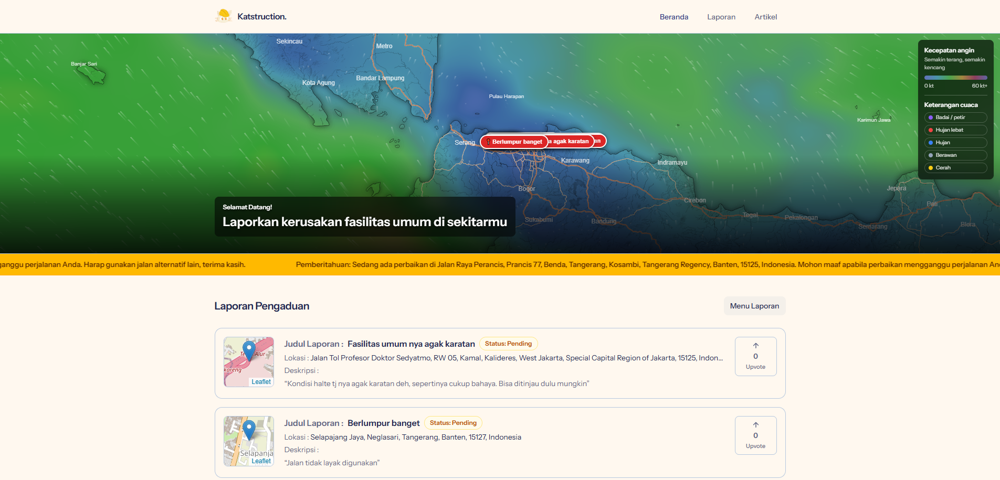

  <p><em>Homepage - Ringkasan laporan, peta, dan artikel terbaru</em></p>

  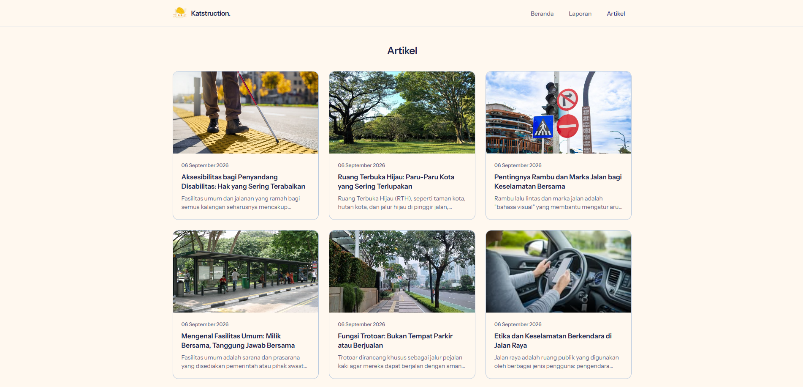

  <p><em>Menu Artikel</em></p>

  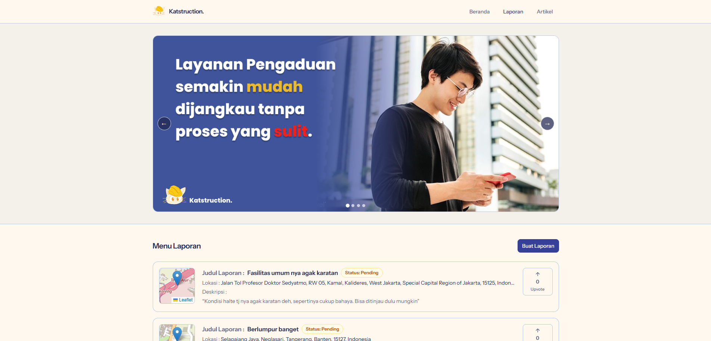

  <p><em>Menu Laporan</em></p>

  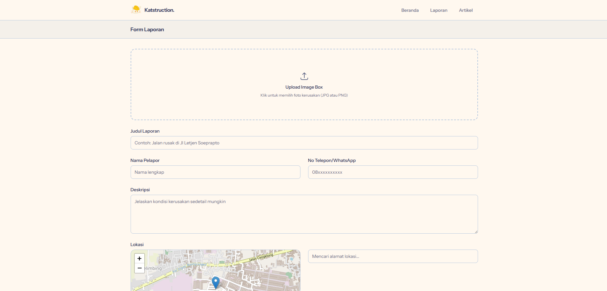

  <p><em>Form Laporan - Pengiriman laporan infrastruktur oleh warga</em></p>

  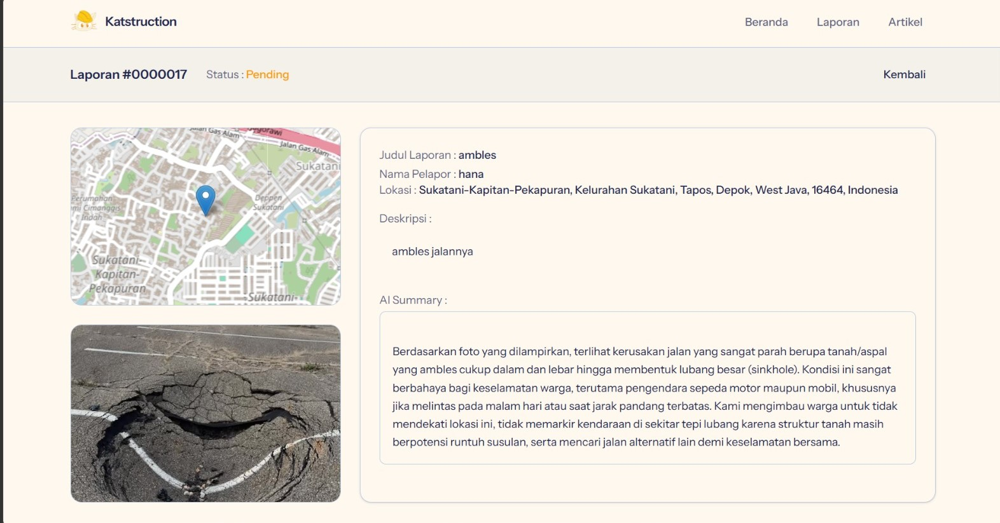

  <p><em>Contoh Laporan infrastruktur oleh warga</em></p>

  <p><strong>Sisi Admin</strong></p>

  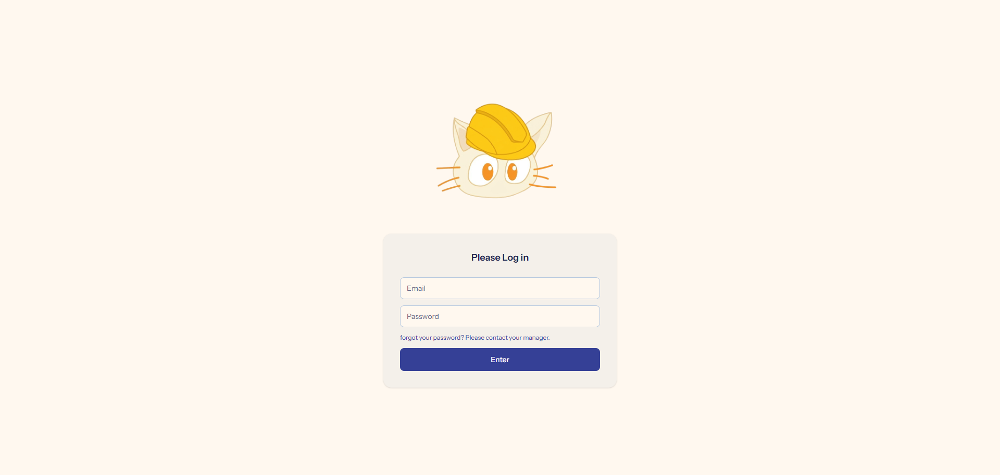

  <p><em>Login Page Admin - Harus memasukkan email dan password</em></p>

  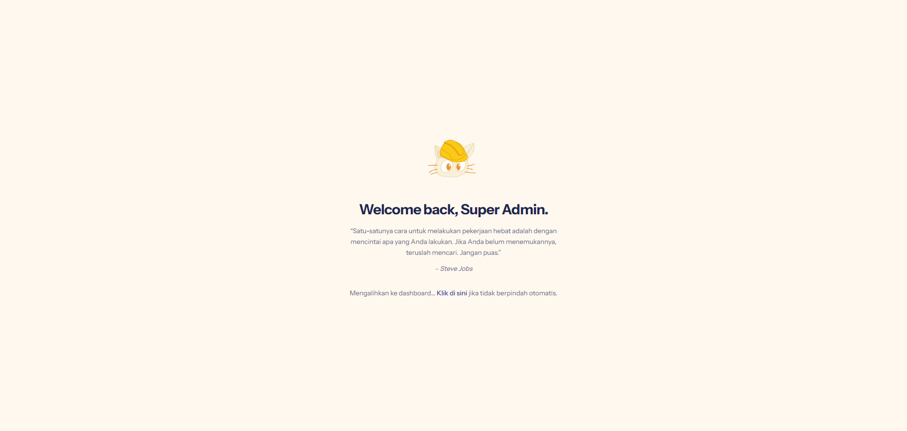

  <p><em>Welcome Page Admin</em></p>

  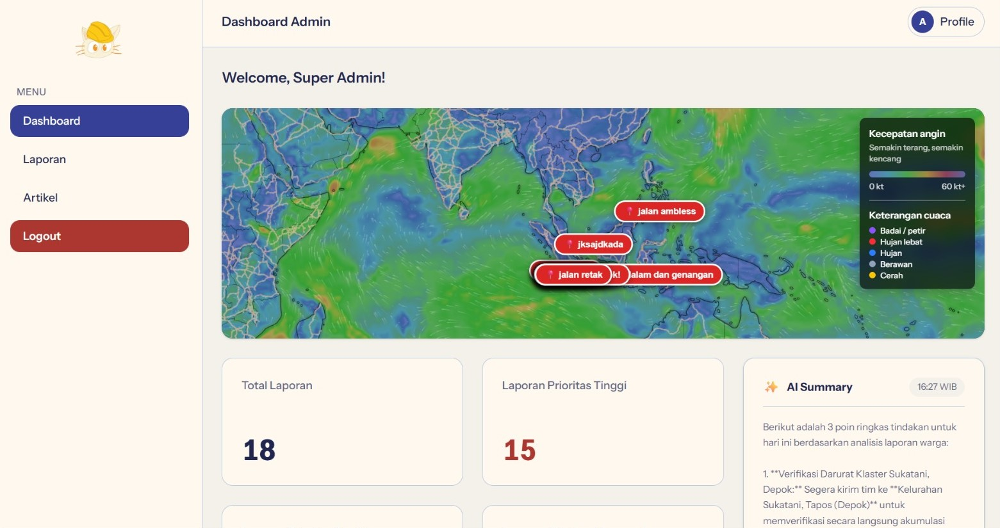

  <p><em>Dashboard Admin - Monitoring dan pengelolaan laporan</em></p>

  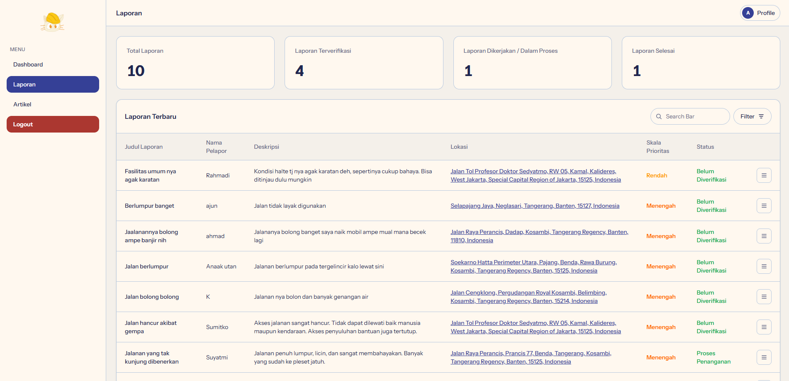

  <p><em>Menu Laporan Admin</em></p>

  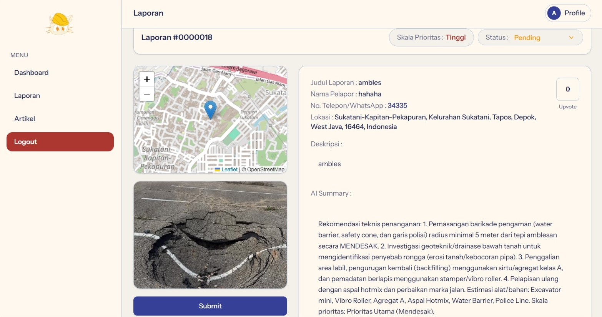

  <p><em>View Laporan Admin</em></p>

  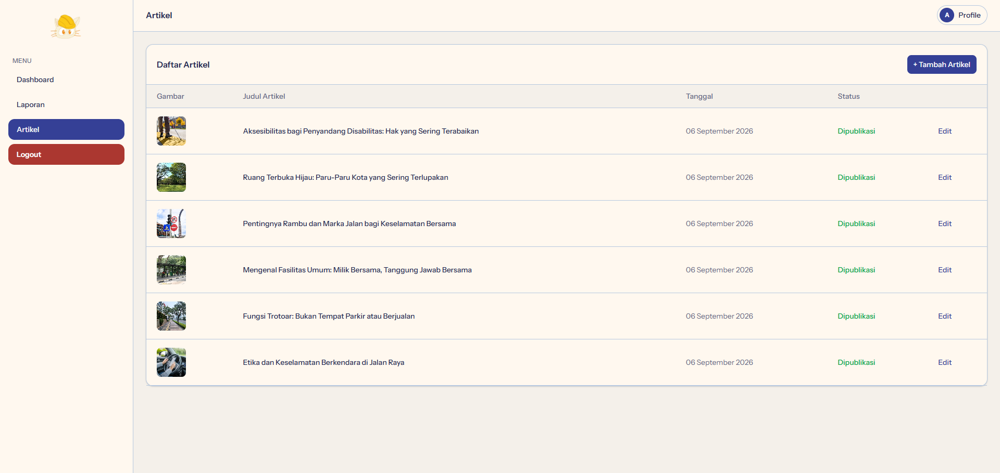

  <p><em>Menu Artikel Admin</em></p>

  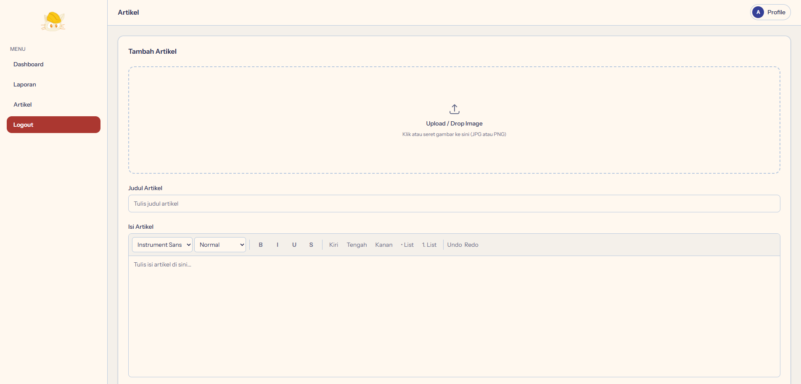

  <p><em>Form Artikel Admin</em></p>

</div>

### Video Demo

Tambahkan tautan video demo setelah tersedia: **[Link Video Demo](https://drive.google.com/drive/folders/1g8Au-V1t8ehk1Sifxjh8Dwfv6JukuLEI?usp=sharing)**

---

## Teknologi

### Tech Stack

#### Frontend

```text
Template       : Laravel Blade
CSS            : Tailwind CSS 4
JavaScript     : Vanilla JavaScript dan Fetch API
Build Tool     : Vite
Maps           : Leaflet dan OpenStreetMap
Weather        : Open-Meteo API
```

#### Backend

```text
Runtime        : PHP 8.2+
Framework      : Laravel 12
Database       : SQLite (default) atau MySQL
ORM            : Laravel Eloquent
Authentication  : Laravel session dan custom admin guard
AI Integration  : Google Gemini API
Queue          : Laravel database queue
```

#### DevOps dan Tools

```text
Dependency     : Composer dan npm
Asset Build    : Vite
Testing        : PHPUnit melalui Laravel Test Runner
Code Analysis  : Larastan dan PHPStan
Formatting     : Laravel Pint
Local Server   : Laravel Artisan atau Laragon
```

### Alasan Pemilihan Teknologi

| Teknologi | Alasan Pemilihan |
|-----------|------------------|
| **Laravel** | Menyediakan routing, middleware, validasi, ORM, migrasi, queue, dan struktur MVC yang sesuai untuk aplikasi pelaporan. |
| **Blade dan Tailwind CSS** | Memungkinkan pembuatan antarmuka server-rendered yang cepat, responsif, dan konsisten. |
| **Gemini API** | Membantu menghasilkan analisis laporan dari foto dan deskripsi secara otomatis. |
| **Leaflet dan OpenStreetMap** | Menyediakan peta interaktif dan penanda lokasi tanpa bergantung pada layanan peta berbayar. |
| **MySQL atau SQLite** | Mendukung pengembangan lokal yang ringan sekaligus deployment ke database produksi. |

### Dependencies Utama

```json
{
  "backend": {
    "php": "^8.2",
    "laravel/framework": "^12.0",
    "laravel/tinker": "^2.10.1"
  },
  "frontend": {
    "tailwindcss": "^4.0.0",
    "vite": "^7.0.7",
    "laravel-vite-plugin": "^2.0.0",
    "axios": "^1.11.0"
  }
}
```

---

## Arsitektur Sistem

### System Architecture

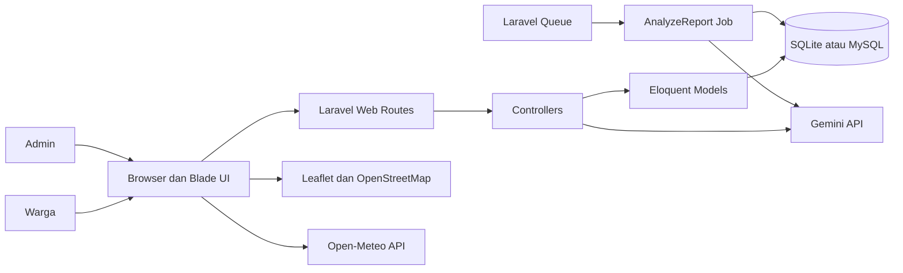

### Alur Pelaporan

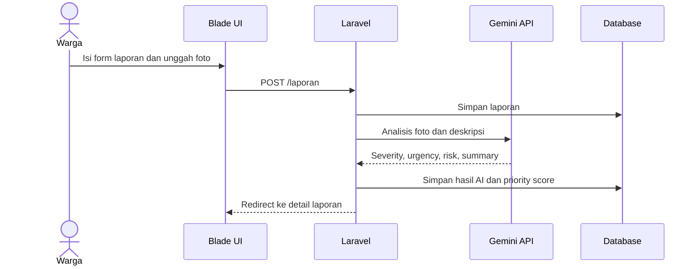

### Database Schema

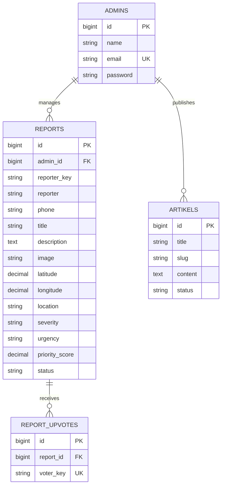

### Folder Structure

```text
itechnoo/
├── app/
│   ├── Console/Commands/       # Perintah Artisan
│   ├── Http/Controllers/       # Controller publik dan admin
│   ├── Jobs/                   # Background job analisis laporan
│   ├── Models/                 # Model Eloquent
│   ├── Services/               # Gemini dan weather service
│   └── Providers/              # Service provider aplikasi
├── bootstrap/                  # Bootstrap aplikasi Laravel
├── config/                    # Konfigurasi aplikasi dan layanan
├── database/
│   ├── factories/              # Factory testing
│   ├── migrations/             # Skema database
│   └── seeders/                # Seeder admin dan data awal
├── public/                    # Entry point dan hasil build aset
├── resources/
│   ├── css/                    # CSS aplikasi
│   ├── js/                     # JavaScript dan bootstrap frontend
│   └── views/                  # Blade views dan komponen
├── routes/web.php              # Route publik dan admin
├── storage/                   # Upload, cache, session, dan log
├── tests/                     # Unit test dan feature test
├── composer.json               # Dependency dan script PHP
├── package.json                # Dependency dan script frontend
└── vite.config.js              # Konfigurasi Vite
```

---

## Instalasi dan Setup

### Prerequisites

Pastikan sudah terpasang:

- **PHP 8.2 atau lebih tinggi**
- **Composer**
- **Node.js dan npm**
- **SQLite atau MySQL**
- **Git**
- **Ekstensi PHP** yang dibutuhkan Laravel, termasuk PDO, OpenSSL, Mbstring, dan Fileinfo

### Langkah Instalasi

#### 1. Clone Repository

```bash
git clone https://github.com/hnfws/Itechnoo.git
cd itechnoo
```

#### 2. Install Dependencies

```bash
composer install
npm install
```

#### 3. Setup Environment Variables

Salin file environment:

```bash
copy .env.example .env
php artisan key:generate
```

Atau pada macOS/Linux:

```bash
cp .env.example .env
php artisan key:generate
```
API Key yang dapat digunakan: **[Link Drive API Key](https://drive.google.com/drive/folders/1Hl-Nyr0qRRZMLZmuqdUZHgHUWGqqCJAx?usp=sharing)**

Contoh konfigurasi SQLite:

```env
APP_NAME=Katstruction.
APP_URL=http://localhost:8000

DB_CONNECTION=sqlite

GEMINI_API_KEY=your_gemini_api_key
GEMINI_MODEL=gemini-3.6-flash

# Opsional, sesuai layanan yang digunakan aplikasi
WEATHER_API_KEY=
WINDY_API_KEY=
GROQ_API_KEY=
GEMINI_SUMMARY_API_KEY=
```

Untuk MySQL, gunakan konfigurasi berikut sebagai pengganti SQLite:

```env
DB_CONNECTION=mysql
DB_HOST=127.0.0.1
DB_PORT=3306
DB_DATABASE=itechnoo
DB_USERNAME=root
DB_PASSWORD=
```

#### 4. Setup Database dan Storage

```bash
php artisan migrate
php artisan db:seed
php artisan storage:link
```

Seeder pengembangan membuat akun admin:

```text
Email    : admin@gmail.com
Password : password123
```

Ganti kredensial tersebut untuk lingkungan produksi.

#### 5. Jalankan Aplikasi

Untuk server Laravel dan Vite secara terpisah:

```bash
php artisan serve
npm run dev
```

Aplikasi tersedia di `http://localhost:8000`.

Alternatif menggunakan script Composer:

```bash
composer run dev
```

---

## Penggunaan

### Menjalankan Aplikasi

```bash
# Development server dan Vite
composer run dev

# Build asset production
npm run build

# Jalankan test
php artisan test

# Cek kualitas kode PHP
vendor/bin/phpstan analyse
vendor/bin/pint --test
```

### User Guide

#### Untuk Pengguna Umum

1. Buka halaman utama dan pilih menu **Buat Laporan**.
2. Isi judul, nama, nomor telepon, deskripsi, foto, serta lokasi laporan.
3. Pilih apakah nama ingin ditampilkan dan setujui persyaratan pengiriman.
4. Kirim laporan dan buka halaman detail untuk melihat hasil analisis AI.
5. Pada daftar laporan, tekan **Upvote** untuk memberi dukungan.
6. Tekan kembali tombol dukungan untuk melakukan **Unvote**.
7. Lihat status penanganan, skor prioritas, peta, dan artikel informasi yang tersedia.

#### Untuk Admin

1. Buka `/admin/login` dan masuk menggunakan akun admin.
2. Gunakan dashboard untuk melihat jumlah laporan berdasarkan kategori prioritas dan status.
3. Buka daftar laporan untuk mencari atau memfilter laporan.
4. Buka detail laporan untuk melihat data warga, foto, peta, ringkasan AI admin, dan jumlah dukungan.
5. Ubah status laporan lalu tekan **Submit**.
6. Kelola artikel melalui menu artikel admin.
7. Gunakan fitur hapus hanya ketika laporan memang perlu dihapus.

---

## API Documentation

Proyek ini menggunakan route web Laravel dan belum menyediakan prefix REST `/api`. Request AJAX untuk upvote menggunakan endpoint web berikut.

### Base URL

```text
Development(masyarakat): http://localhost:8000
Development(admin): http://localhost:8000
Production(masyarakat):  http://ptrs.site.je/
Production(admin) : http://ptrs.site.je/admin/
```

### Route Publik

```http
GET  /                            # Homepage
GET  /laporan                     # Daftar laporan
GET  /laporan/buat                # Form laporan
POST /laporan                    # Simpan laporan baru
GET  /laporan/{id}                # Detail laporan
POST /laporan/{id}/upvote         # Toggle upvote atau unvote via AJAX
POST /laporan/{id}/analisis-ulang # Jalankan analisis AI ulang
GET  /artikel                     # Daftar artikel
GET  /artikel/{artikel}           # Detail artikel
```

### Route Admin

```http
GET    /admin/login
POST   /admin/login
POST   /admin/logout
GET    /admin/dashboard
GET    /admin/laporan
GET    /admin/laporan/{id}
PATCH  /admin/laporan/{id}/status
DELETE /admin/laporan/{id}
GET    /admin/artikel
GET    /admin/artikel/buat
POST   /admin/artikel/simpan
PATCH  /admin/artikel/{artikel}
DELETE /admin/artikel/{artikel}
```

### Contoh Request Upvote AJAX

```javascript
const response = await fetch('/laporan/1/upvote', {
    method: 'POST',
    headers: {
        'Accept': 'application/json',
        'X-CSRF-TOKEN': document.querySelector('input[name="_token"]').value,
        'X-Requested-With': 'XMLHttpRequest'
    }
});

const data = await response.json();
// { upvote_count: 1, has_upvoted: true, priority_score: 23.4 }
```

---

## Testing

### Menjalankan Test

```bash
php artisan test
```

Test yang tersedia berada di folder `tests/Feature` dan `tests/Unit`. Tambahkan test feature untuk alur pembuatan laporan, autentikasi admin, perubahan status, serta toggle upvote ketika fitur dikembangkan lebih lanjut.

### Static Analysis dan Formatting

```bash
vendor/bin/phpstan analyse
vendor/bin/pint --test
```

### Status Validasi Saat Ini

```text
Laravel tests : 2 passed
Frontend build: npm run build berhasil
```

---

## Lisensi

Proyek ini dilisensikan di bawah **MIT License**. Tambahkan file `LICENSE` berisi teks lisensi MIT sebelum mempublikasikan repository secara resmi.

---

<div align="center">

**Made with care by WNI Suka Bobo for ITECHNO CUP 2026**

</div>
